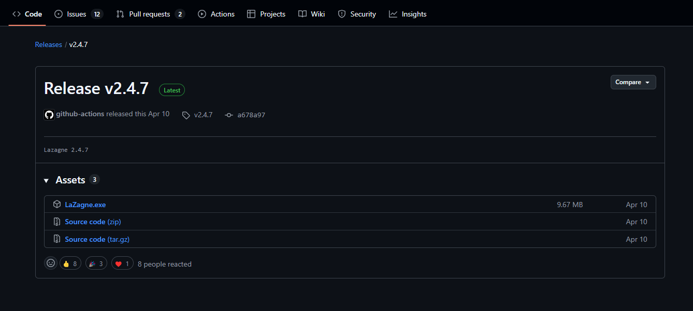
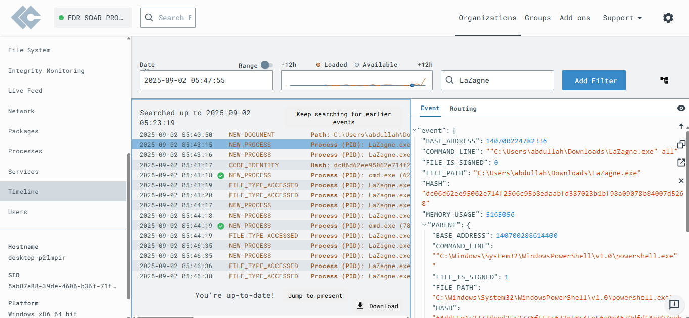
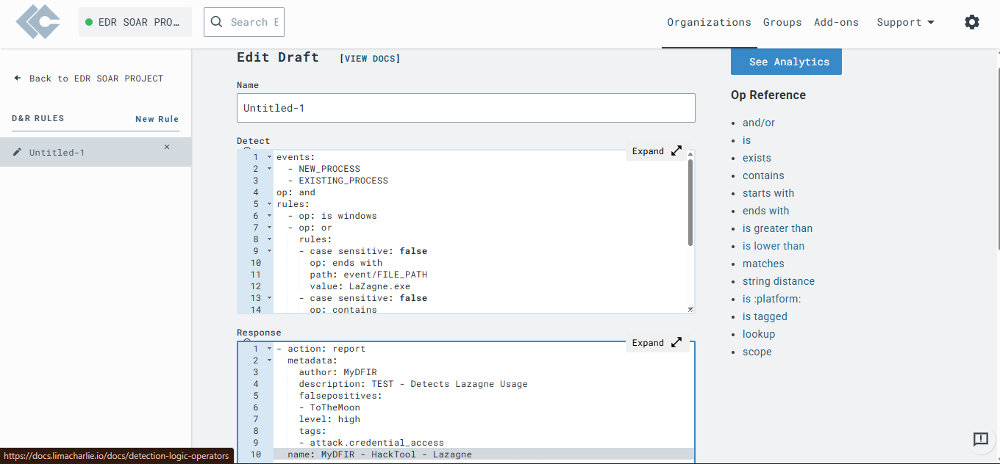
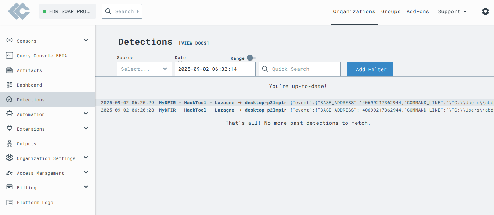
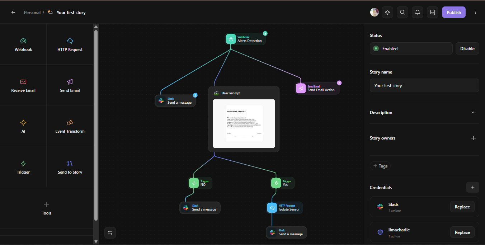
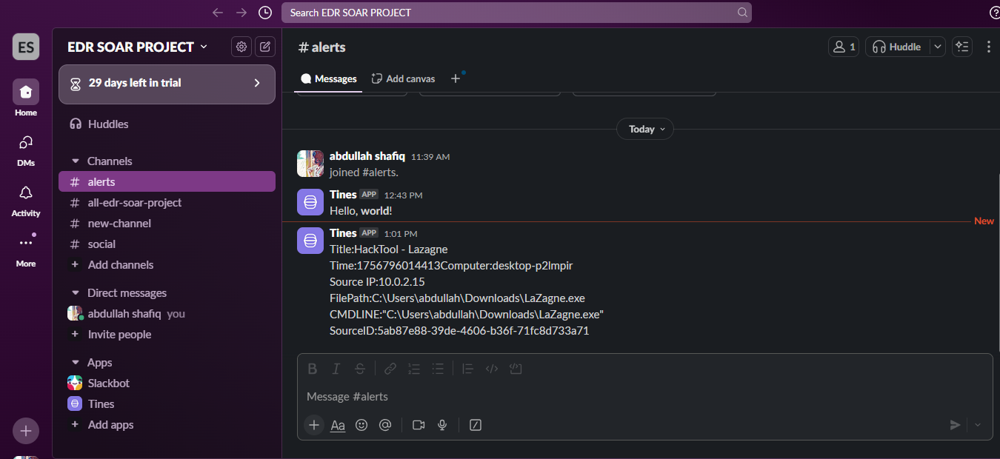

# EDR-THREAT-DETECTION-AND-RESPONSE

A cybersecurity project demonstrating Endpoint Detection and Response (EDR) and Security Orchestration, Automation, and Response (SOAR) using LimaCharlie and Tines. 

## Project Overview
This project simulates threat detection and automated response:
- **LimaCharlie**: Detects threats (e.g., LaZagne tool) using a sensor on a Windows 10 VM.
- **Tines**: Automates response by sending alerts to Slack.
- A rule in LimaCharlie detects LaZagne execution, forwards alerts to Tines via webhook, and Tines sends a Slack notification.

## Steps
1. **Download LaZagne**: Downloaded LaZagne.exe from GitHub to simulate a threat.

    

2. **Check Telemetry**: Verified LaZagne events in LimaCharlie's Timeline.

   

3. **Create D&R Rule**: Added a rule in LimaCharlie to detect LaZagne execution.

    

4. **Detect Threat**: Ran LaZagne to trigger a detection alert.

   

5. **Tines Webhook**: Configured webhook to send alerts from LimaCharlie to Tines.

    

6. **Slack Notification**: Tines sent a Slack message with threat details.

     

## Tools Used
- **LimaCharlie**: EDR platform for threat detection.
- **Tines**: SOAR platform for automation.
- **Windows 10 VM**: For running LaZagne and testing.
- **Slack**: For receiving alerts.

## Learnings
- Creating detection rules using YAML.
- Integrating EDR and SOAR via webhooks.
- Automating threat response with Slack notifications.
- Useful for SOC Analyst roles and cybersecurity portfolio.

## How to Run
1. Set up LimaCharlie account and install sensor on a Windows 10 VM.
2. Download LaZagne.exe from GitHub.
3. Create a D&R rule in LimaCharlie (use provided YAML code).
4. Set up Tines with a webhook and Slack integration.
5. Test by running LaZagne and checking alerts in LimaCharlie and Slack.

